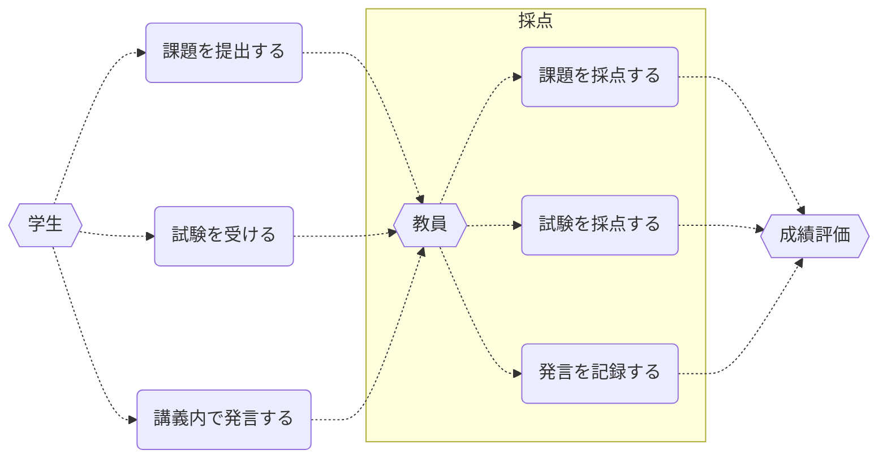

```mermaid
flowchart LR
S{{学生}}
a(課題を提出する)
b(試験を受ける)
c(講義内で発言する)
T{{教員}}
d(課題を採点する)
e(試験を採点する)
f(発言を記録する)
P{{成績評価}}

S-.->a-.->T-.->d-.->P
S-.->b-.->T-.->e-.->P
S-.->c-.->T-.->f-.->P
subgraph 採点
T
d
e
f

end
```
