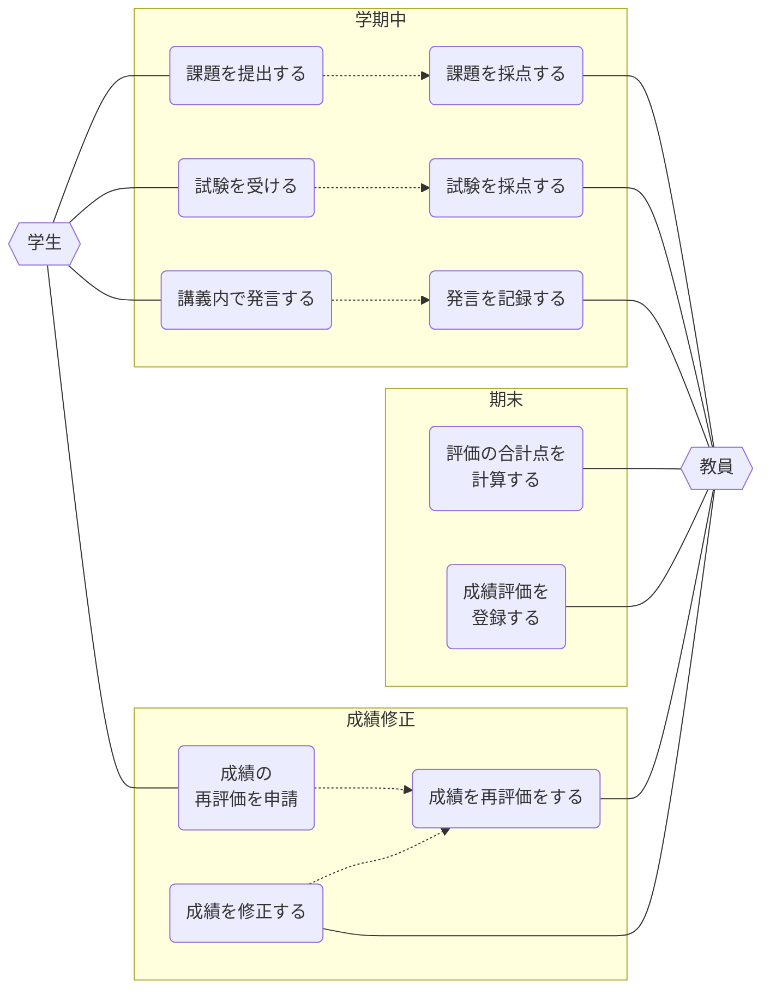

```mermaid
flowchart LR
S{{学生}}
a(課題を提出する) -.-> d(課題を採点する)
b(試験を受ける) -.-> e(試験を採点する)
c(講義内で発言する) -.-> f(発言を記録する)
T{{教員}}
g("評価の合計点を\n計算する")
h("成績評価を\n登録する")
i("成績の\n再評価を申請")
j(成績を再評価をする)
k(成績を修正する)

S --- a & b & c
d & e & f & g & h & j & k --- T
S --- i -.-> j
k -.-> j
subgraph 学期中
a
b
c
d
e
f
end
subgraph 期末
g
h
end
subgraph 成績修正
i
j
k
end
```
